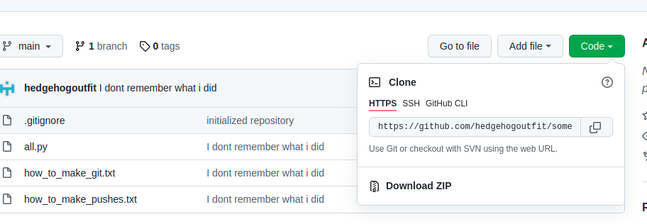
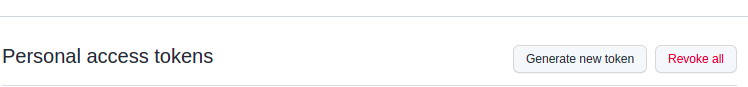

1. Установить git если нету - https://git-scm.com/book/ru/v2/%D0%92%D0%B2%D0%B5%D0%B4%D0%B5%D0%BD%D0%B8%D0%B5-%D0%A3%D1%81%D1%82%D0%B0%D0%BD%D0%BE%D0%B2%D0%BA%D0%B0-Git
2. В терминале делаем: git config --global user.email "<имейл гитхаб-аккаунта>"
3. В терминале делаем: git config --global user.name "<имя гитхаб-аккаунта>"
4. Заходим сюда -https://github.com/hedgehogoutfit/some-events
5. Нажимаем под Code иконочку копирования, в буффере будет ссылка

6. Заходим в папку в которую надо скопировать проект
7. Делаем git clone <скопированная ссылка из буффера> в терминале, теперь понадобится пароль-токен и имя вашего аккаунта на гитхабе
8. В аккаунте заходим сюда - https://github.com/settings/tokens

9. Нажимаем на Generate new token
10. Делаем expire максимальным - 90 дней
11. Возвращаясь к шагу 7 вводим наш юзернейм и пароль-токен
12. Все